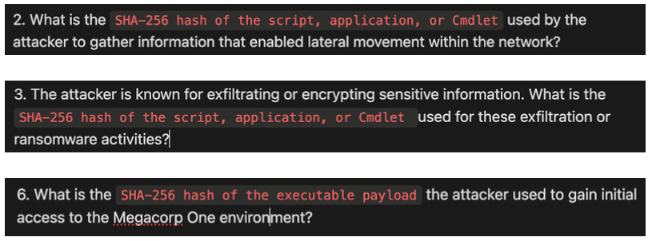
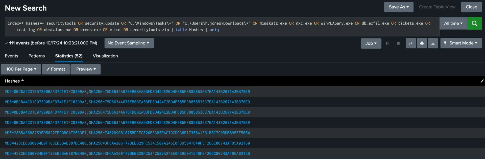
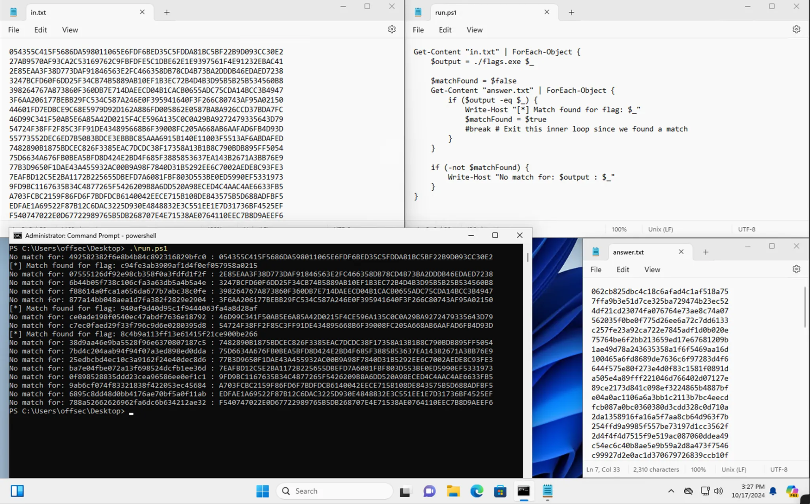
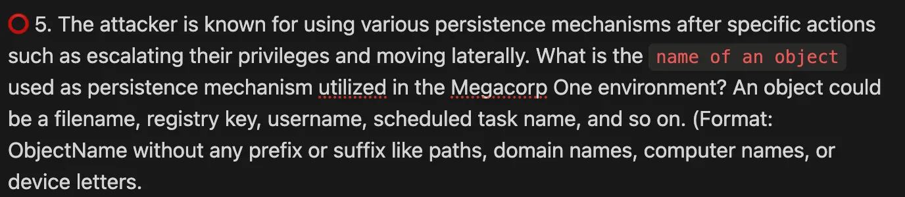
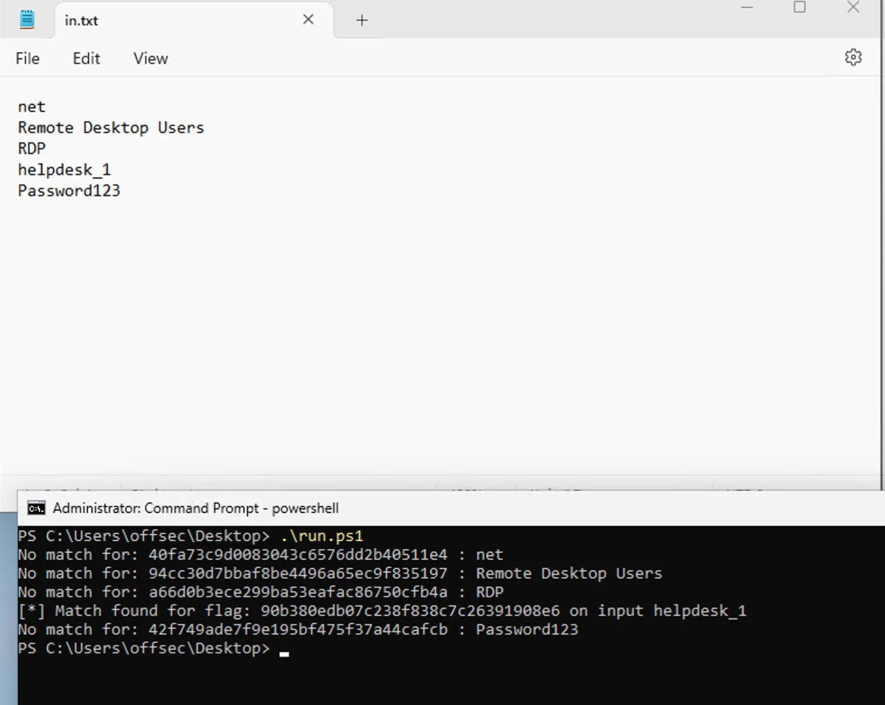

# OSTH Script for hash submissions

## Description
Basic powershell script that takes inputs from in.txt file, parses it through flag.exe and compares outputs with potential correct answer in answer.txt

## Usage
- transfer `run.ps1` to folder where flag.exe is located (Desktop by default)
- create answer.txt with all given hashes as an answers and in.txt where we input our potential correct answers
- open powershell,  `Set-ExecutionPolicy Bypass` and execute `.\run.ps1`

## run.ps1 content
```powershell
Get-Content "in.txt" | ForEach-Object {
	$output = ./flags.exe $_
	$in = $_
	$matchFound = $false
	Get-Content "answer.txt" | ForEach-Object {
		if ($output -eq $_) {
			Write-Host "[*] Match found for flag: $_ on input $in"
			$matchFound = $true
			break #Break on correct answer, comment if you want to check more flags
		}
	}
	if (-not $matchFound) {
		Write-Host "No match for: $output : $_"
	}
}
```


## Reason
It can be frustrating to find exact timestamp of some event or what specific program threat actor used to do specific action on target. But with this script we can narrow down our KQL to extract potential answers and brute force them until we get correct one.

## example 1
In this example, we are looking for SHA256 hashes of different executables on the system.


After threat hunting I managed to create following KQL with IOCs of dropped files by threat actor.
```KQL
index=* Hashes=* securitytools OR security_update OR "C:\Windows\Tasks\*" OR "C:\Users\h.jones\Downloads\*" OR mimikatz.exe OR nxc.exe OR winPEASany.exe OR db_exfil.exe OR tickets.exe OR test.log OR dbstatus.exe OR creds.exe OR *.bat OR securitytools.zip | table Hashes | uniq
```


We input all potential answers to answer.txt file, dump all SHA256 from Splunk output to in.txt file and run script to get answers.


We got three out of three hits, nice.

## example 2
In the following question, it can be tricky to distinguish what exactly are they looking for an answer.


Following are commands ran by the threat actor
```powershell
"C:\Windows\Tasks\creds.exe" privilege::debug "sekurlsa::minidump lsass.dmp" sekurlsa::logonpasswords exit
"C:\Windows\system32\net.exe" localgroup "Remote Desktop Users" helpdesk_1 /add
"C:\Windows\system32\net.exe" localgroup Administrators helpdesk_1 /add
"C:\Windows\system32\net.exe" user
"C:\Windows\system32\net.exe" user helpdesk_1 Password123 /add
```

So the answer could be new username, new password, name of the lsass dump or something else in other cases. We can break down all possible answers in in.txt file and try to brute force them.


Now we can see that they were looking for new username on the host, `helpdesk_1`